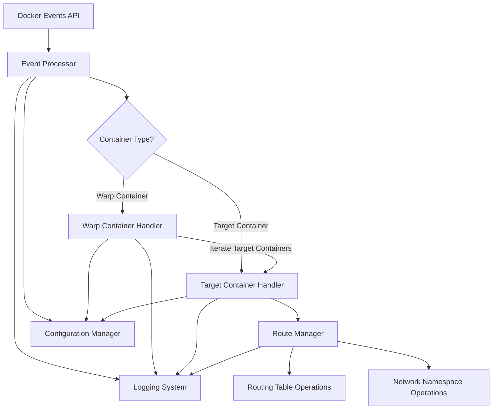

# Design Document

## Overview

The Docker Network Warp system is a Rust-based service that automatically manages container network routing by monitoring Docker events and manipulating network namespaces and routing tables. The system uses a reactive architecture where Docker events trigger network configuration changes, routing traffic from target containers through designated warp containers.

The application operates as a long-running daemon that maintains persistent connections to the Docker API for event monitoring while performing network operations through native Linux networking APIs.

## Architecture

### High-Level Architecture



### Component Architecture

The system follows a modular design with clear separation of concerns:

1. **Event Monitor**: Handles Docker API event streaming
2. **Container Classifier**: Determines container types based on labels/names
3. **Route Manager**: Manages routing table operations
4. **Network Manager**: Identify target container's network namespace and run required route table operations in it
5. **Configuration Manager**: Manages multi-source configuration

## Components and Interfaces

### Event Monitor Component

**Purpose**: Monitors Docker events and dispatches them to appropriate handlers. Supports connecting to Docker Daemon via socket, local, HTTP and SSL (if `feature = "ssl"` is enabled)

**Key Dependencies**:

- `bollard` or `docker-api` crate for Docker API interaction
- `tokio` for async event streaming

**Interface**:

```rust
pub trait EventMonitor {
    async fn start_monitoring(&self) -> Result<(), EventError>;
    async fn stop_monitoring(&self) -> Result<(), EventError>;
    fn subscribe_to_events(&self, handler: Box<dyn EventHandler>) -> Result<(), EventError>;
}

pub trait EventHandler {
    async fn handle_container_start(&self, event: ContainerStartEvent) -> Result<(), HandlerError>;
}
```

### Container Classifier Component

**Purpose**: Analyzes container metadata to determine if it's a warp or target container.

**Interface**:

```rust
pub trait ContainerClassifier {
    fn classify_container(&self, container: &ContainerInfo) -> ContainerType;
    fn extract_warp_target(&self, container: &ContainerInfo) -> Option<String>;
    fn extract_network_preference(&self, container: &ContainerInfo) -> Option<String>;
}

pub enum ContainerType {
    WarpContainer(WarpContainerInfo),
    TargetContainer(TargetContainerInfo),
    Ignored,
}
```

### Route Manager Component

**Purpose**: Manages routing table operations within container network namespaces.

**Key Dependencies**:

- `rtnetlink` for netlink-based routing operations
- `netns-rs` for network namespace management

**Interface**:

```rust
pub trait RouteManager {
    async fn add_route(&self, namespace: &NetworkNamespace, route: &RouteEntry) -> Result<(), RouteError>;
    async fn remove_route(&self, namespace: &NetworkNamespace, route: &RouteEntry) -> Result<(), RouteError>;
    async fn list_routes(&self, namespace: &NetworkNamespace) -> Result<Vec<RouteEntry>, RouteError>;
}

pub struct RouteEntry {
    pub destination: IpNetwork,
    pub gateway: IpAddr,
    pub interface: Option<String>,
    pub metric: Option<u32>,
}
```

### Network Manager Component

**Purpose**: Handles network namespace operations and container network discovery.

**Key Dependencies**:

- `netns-rs` for namespace operations
- `bollard` for container network inspection

**Interface**:

```rust
pub trait NetworkManager {
    async fn get_container_namespace(&self, container_id: &str) -> Result<NetworkNamespace, NetworkError>;
    async fn get_container_networks(&self, container_id: &str) -> Result<Vec<NetworkInfo>, NetworkError>;
    async fn resolve_container_ip(&self, container_id: &str, network: Option<&str>) -> Result<IpAddr, NetworkError>;
}

pub struct NetworkInfo {
    pub name: String,
    pub ip_address: IpAddr,
    pub gateway: Option<IpAddr>,
    pub subnet: IpNetwork,
}
```

### Configuration Manager Component

**Purpose**: Manages configuration from multiple sources with proper precedence.

**Key Dependencies**:

- `clap` for command-line argument parsing
- `serde` and `toml` for configuration file parsing
- `config` crate for layered configuration management

**Interface**:

```rust
pub trait ConfigurationManager {
    fn load_configuration(&self) -> Result<AppConfig, ConfigError>;
    fn get_warp_container_pattern(&self) -> &str;
    fn get_target_container_label(&self) -> &str;
    fn get_network_preference_label(&self) -> &str;
    fn get_routing_rules(&self) -> &[RoutingRule];
}

pub struct AppConfig {
    pub warp_container_pattern: String,
    pub target_container_label: String,
    pub network_preference_label: String,
    pub routing_rules: Vec<RoutingRule>,
    pub log_level: String,
    pub docker_socket: String,
}
```

## Data Models

### Core Data Structures

```rust
#[derive(Debug, Clone)]
pub struct ContainerInfo {
    pub id: String,
    pub name: String,
    pub labels: HashMap<String, String>,
    pub networks: Vec<NetworkInfo>,
    pub state: ContainerState,
}

#[derive(Debug, Clone)]
pub struct WarpContainerInfo {
    pub container: ContainerInfo,
    pub target_network: Option<String>,
}

#[derive(Debug, Clone)]
pub struct TargetContainerInfo {
    pub container: ContainerInfo,
    pub warp_target: String,
}

#[derive(Debug, Clone)]
pub struct RoutingRule {
    pub destination: IpNetwork,
    pub protocol: Option<Protocol>,
    pub port_range: Option<(u16, u16)>,
}

#[derive(Debug, Clone)]
pub enum ContainerState {
    Starting,
    Running,
    Stopping,
    Stopped,
}
```

### Configuration Data Models

```rust
#[derive(Debug, Deserialize)]
pub struct TomlConfig {
    pub docker_connection_method: Option<String>
    pub warp_container_name_pattern: Option<String>,
    pub target_container_label: Option<String>,
    pub network_preference_label: Option<String>,
    pub routing_rules: Option<Vec<TomlRoutingRule>>,
    pub logging: Option<LoggingConfig>,
    pub docker: Option<DockerConfig>,
}

#[derive(Debug, Deserialize)]
pub struct LoggingConfig {
    pub level: Option<String>,
    pub format: Option<String>,
}

#[derive(Debug, Deserialize)]
pub struct DockerConfig {
    pub socket: Option<String>,
    pub api_version: Option<String>,
}
```

## Error Handling

### Error Types Hierarchy

```rust
#[derive(Debug, thiserror::Error)]
pub enum AppError {
    #[error("Docker API error: {0}")]
    Docker(#[from] DockerError),

    #[error("Network operation error: {0}")]
    Network(#[from] NetworkError),

    #[error("Route management error: {0}")]
    Route(#[from] RouteError),

    #[error("Configuration error: {0}")]
    Config(#[from] ConfigError),

    #[error("Event processing error: {0}")]
    Event(#[from] EventError),
}

#[derive(Debug, thiserror::Error)]
pub enum NetworkError {
    #[error("Failed to access network namespace: {0}")]
    NamespaceAccess(String),

    #[error("Container network not found: {container_id}")]
    NetworkNotFound { container_id: String },

    #[error("Insufficient privileges for network operation")]
    InsufficientPrivileges,
}

#[derive(Debug, thiserror::Error)]
pub enum RouteError {
    #[error("Failed to add route: {0}")]
    AddRoute(String),

    #[error("Failed to remove route: {0}")]
    RemoveRoute(String),

    #[error("Route already exists: {0}")]
    RouteExists(String),
}
```

### Error Recovery Strategies

1. **Docker Connection Failures**: Implement exponential backoff retry with circuit breaker pattern
2. **Network Operation Failures**: Log errors and continue processing other containers
3. **Permission Errors**: Fail fast with clear error messages about required privileges
4. **Configuration Errors**: Validate configuration at startup and fail early. Provide a config validating CLI command to check configuration without really starting the application
5. **Event Processing Errors**: Isolate errors to individual events, continue monitoring

## Testing Strategy

### Unit Testing

- **Component Isolation**: Mock external dependencies (Docker API, netlink operations)
- **Configuration Testing**: Test all configuration sources and precedence rules
- **Error Handling**: Test error conditions and recovery mechanisms
- **Container Classification**: Test label matching and container type detection

### Integration Testing

- **Docker Integration**: Test with real Docker containers in controlled environment
- **Network Operations**: Test routing table modifications in isolated network namespaces
- **Event Processing**: Test end-to-end event handling with container lifecycle events
- **Configuration Integration**: Test configuration loading from all sources

### Test Infrastructure

```rust
// Mock traits for testing
pub trait MockDockerApi: DockerApi {
    fn set_containers(&mut self, containers: Vec<ContainerInfo>);
    fn trigger_event(&mut self, event: DockerEvent);
}

pub trait MockNetworkManager: NetworkManager {
    fn set_namespace_response(&mut self, container_id: &str, namespace: NetworkNamespace);
    fn set_network_response(&mut self, container_id: &str, networks: Vec<NetworkInfo>);
}

// Test utilities
pub struct TestEnvironment {
    pub docker_mock: MockDockerApi,
    pub network_mock: MockNetworkManager,
    pub temp_config: TempDir,
}

impl TestEnvironment {
    pub fn new() -> Self { /* ... */ }
    pub fn create_test_container(&self, container_type: ContainerType) -> ContainerInfo { /* ... */ }
    pub fn simulate_container_start(&mut self, container: ContainerInfo) { /* ... */ }
}
```

### Performance Testing

Not required.

### Security Testing

- **Privilege Validation**: Test behavior with insufficient privileges
- **Input Validation**: Test with malformed container labels and configurations
- **Resource Limits**: Test behavior under resource constraints
- **Network Isolation**: Verify routing changes don't affect unintended containers
